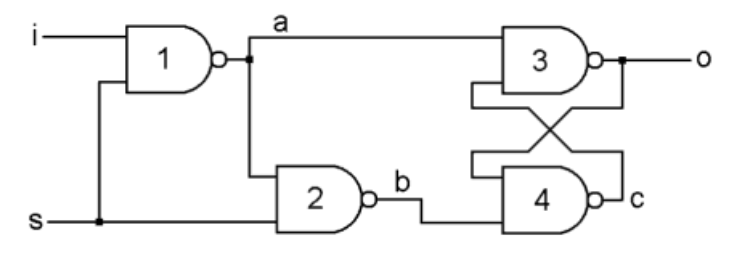

Following the observation that a von Neumann computer is (almost) entirely composed of many instances of a single fundamental unit (the NAND gate), wired together in particular patterns that are themselves wired together in similarly-particular patterns: each of these units invariably feeding their output into the input of the next, it occurred to me that the hardware of a computer is—save for a few easily-modelled tricks of electronics—arranged much like the structure of a functional program.

Specifically, each state is informed by the previous state of the computer; no unit of the computer, defined at the NAND-gate level of abstraction, can be said to "store" data at all: rather, I assert that a simplified computer system like the aforementioned 8-bit proof-of-concept (I do not doubt that the engineers employed to design real-life computer systems make use of a myriad of dirty physics tricks to which I wish to remain blissfully oblivious) can be entirely represented as the logical flow of data through functional operators.

The simplest example of this is the D-Type Latch: the most primitive unit of data storage in a computer.

One might expect it to function similarly to the electron trap in a solid-state drive, or more generally to toggle between two stable _physical_ states; however, even a cursory inspection of its construction reveals that the mechanism by which it stores data is recursive. In other words, it can be said that it is not the physical system itself that does the _storage_ of the bit—but in fact the interaction between these logical NAND functions.

Upon slightly deeper examination of this diagram, a rebuttal to my thesis might present itself: that the D-Type Latch is not, in fact, pure; it outputs both another function call (recursively) _and_ a simple Boolean (at o)! I would suggest, in response, that this issue exists only because the physical circuit was designed to work in a physical world with continuous time, and that it is not at all an issue in the discrete time of a logical state simulation, nor does the logical representation that I choose deviate in any way from the logical functioning of the D-Type Latch; to sustain the continuous output of a particular bit at o, this output must constantly be passed back into Gate 4 (the function is, in effect, re-evaluated continuously) with no interruption—a state buffer can be used in a discrete-time logical simulation, however, that simply treats o as a third input, and passes to it its previous output for a single function evaluation. Put simply, the physical circuit in this diagram is forced to be impure, since continuous time begets continuous evaluation; passing the previous state as an input at o is merely a discretisation of a system that is already logically discrete. By extension of this principle, one can define increasingly-high-level wrappers for compositions of NAND functions, until one has arrived at a single function that is in fact a wrapper for many hundreds or thousands of NAND functions, curried together to represent the entire logical functioning of an _N_-bit (_N_=8 was an arbitrary decision on my part) computer.

To conclude this introduction, I will reiterate my thesis: I posit that an 8-bit von Neumann computer can be represented as a single, pure function composed solely of curried NAND functions, such that this function and the hardware are logically equivalent at the NAND-gate level of abstraction.

Documentation of programmatic implementation (in Haskell) and architectural decisions will follow.